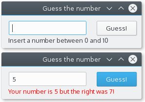

#What?
[](http://www.gnu.org/licenses/gpl-3.0)   



##Qt-C++

That version require QtCreator or qmake to compile.

##Qt-Rust

Working in progress

##Qt-Go

```
go get github.com/therecipe/qt/widgets
go get -u -v github.com/stephenlyu/goqtuic To compile code from ui file (not needed as compiled code already present)
go run cmd/guess/main.go
```
